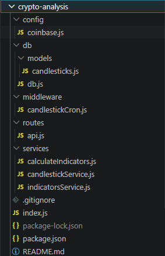
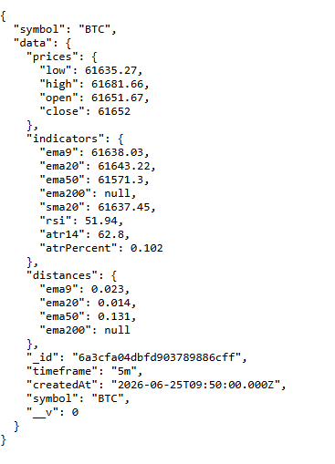

# Crypto Analysis API

A Node.js and MongoDB crypto market data API that collects candlestick data from Coinbase Exchange, calculates technical indicators, and exposes REST endpoints for quantitative analysis.

## Features

* Coinbase market data integration
* 20+ cryptocurrencies
* Multiple timeframes

  * 1m
  * 5m
  * 1h
  * 6h
  * 24h
* MongoDB storage
* Technical indicators

  * EMA 9
  * EMA 20
  * EMA 50
  * EMA 200
  * SMA 20
  * RSI 14
  * ATR 14
* Distance calculations from EMAs
* REST API endpoints

## Architecture

```text
Coinbase Exchange
       |
       v
Data Collector
       |
       v
MongoDB
       |
       v
Indicator Engine
       |
       v
REST API
```

## Installation

Clone the repository:

```bash
git clone https://github.com/ashkangl/crypto-analysis-nodejs.git
cd crypto-analysis-nodejs
```

Install dependencies:

```bash
npm install
```

Create environment file:

```bash
cp .env.example .env
```

Start the application:

```bash
npm start
```

## Environment Variables

```env
PORT=8000
MONGO_URI=mongodb://localhost:27017/crypto-analysis
```

## Supported Coins

BTC, ETH, SOL, XRP, ADA, DOGE, HBAR, AVAX, DOT, LTC, SHIB, LINK, UNI, 1INCH, AAVE, ALGO, ARB, PAXG, SUI, COMP, TRUMP

## Example Candle

```json
{
  "symbol": "BTC",
  "timeframe": "5m",
  "createdAt": "2026-06-25T07:35:00.000Z",
  "prices": {
    "open": 61758.96,
    "high": 61829.57,
    "low": 61758.96,
    "close": 61820.24
  },
  "indicators": {
    "ema9": 61724.38,
    "ema20": 61641.41,
    "ema50": 61397.75,
    "ema200": null,
    "sma20": 61656.78,
    "rsi": 72.83,
    "atrPercent": 0.1417
  },
  "distances": {
    "ema9": 0.155,
    "ema20": 0.290,
    "ema50": 0.688
  }
}
```

## API Endpoints

### Get All Candles

```http
GET /all-candles
```

### Get Candles by Symbol

```http
GET /candles/BTC
```

### Get Candles by Symbol and Timeframe

```http
GET /candles/BTC?timeframe=5m
```

### Get Latest Candle

```http
GET /last-candle/BTC?timeframe=5m
```

## Example Response

```json
{
  "symbol": "BTC",
  "timeframe": "5m",
  "prices": {
    "close": 61820.24
  },
  "indicators": {
    "ema9": 61724.38,
    "rsi": 72.83
  }
}
```

## Screenshots

### Project Structure



### API Response



## Technologies

* Node.js
* Express.js
* MongoDB
* Mongoose
* Coinbase Exchange API

## Author

Ashkan Golzad

Full Stack Developer

Node.js • Next.js • FastAPI • MongoDB • Cryptocurrency Analytics

## License

MIT